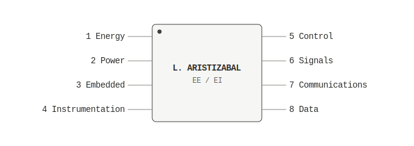

# LUIS ARISTIZABAL
### Electrical & Electronic Engineering — Technical Datasheet · Rev. 1.2

---

## GENERAL DESCRIPTION

Dual-degree student in Electrical Engineering and Electronic Engineering at Universidad de los Andes (Bogotá, Colombia). Work focused on power electronics, embedded systems, and applied control — from traceable photovoltaic emulators to robotic platforms governed by state machines.

---

## FEATURES

- Dual degree: B.Sc. Electrical Engineering + B.Sc. Electronic Engineering
- Design and instrumentation of programmable DC power supplies for microgrids
- Embedded firmware on ESP32/Arduino with state machines and real-time control
- Sensor fusion (IMU, color sensors, wireless telemetry) for robotic platforms

---

## PIN CONFIGURATION — AREAS OF INTEREST

  

---

## ELECTRICAL CHARACTERISTICS

| Parameter | Symbol | Condition / Tools | Status |
|---|---|---|---|
| Power Electronics | P_EE | DC-DC converters, DC microgrids | Proficient |
| Embedded Systems | µC | ESP32, Arduino | Proficient |
| Distributed Control / Game Theory | GNE | Population games, MPC, CasADi | Proficient |
| Signal Processing | DSP | Python, MATLAB | Proficient |
| Circuit Design | PCB | KiCad | Basic–Intermediate |
| Technical Documentation | LaTeX | Reports, papers | Proficient |

---

## TYPICAL APPLICATIONS

| Application | Description | Technologies |
|---|---|---|
| [**EV-Charging-GT**](https://github.com/laristizabal1/EV-Charging-GT.git) | Distributed EV charging coordination via Generalized Nash Equilibrium population games (PG-GNE), benchmarked against MPC and the centralized optimum (CasADi + IPOPT) | `Population Games` `MPC` `CasADi` `Python` |
| [**ARGOS3000**](https://github.com/laristizabal1/ARGOS3000.git) | Multi-sensor wearable (ESP32-S3): LDR, PIR, TILT, MQ135, DHT22, with a gesture-triggered emergency protocol and 433 MHz RF communication between devices, plus a real-time embedded web dashboard | `ESP32-S3` `RF 433MHz` `WebServer` |
| [**PV Array Emulator**](https://github.com/laristizabal1/PV-Emulator.git) | Traceable photovoltaic array emulator based on a programmable DC power supply, for DC microgrids | `Power Electronics` `DC Microgrids` `Instrumentation` |
| [**limpiaVidrios**](https://github.com/fgutep/limpiaVidrios.git) | Window-cleaning robot governed by a motor state machine; NeoPixel voltage-level indicators, TCS34725 color sensor, MPU6050 IMU for orientation, gamepad control (Bluepad32), and WiFi telemetry. Collaborative project with Felipe Gutiérrez | `ESP32` `State Machines` `MPU6050` `NeoPixel` |
| [**MENTORU**](https://github.com/fg-edu-tep/MENTORU.git) | Smart wearable for posture correction, with real-time IMU-based feedback | `ESP32` `MPU6050` `OLED` |

---

## MEASURED PERFORMANCE

---

## REVISION HISTORY

| Rev | Date | Description |
|---|---|---|
| 1.0 | 2026-07 | Initial profile release |
| 1.1 | 2026-07 | Added EV-Charging-GT (PG-GNE) and ARGOS3000; new distributed-control characteristic |
| 1.2 | 2026-07 | Unified profile language to English |

*Linearity of ideas outside the recommended operating range is not guaranteed.*

